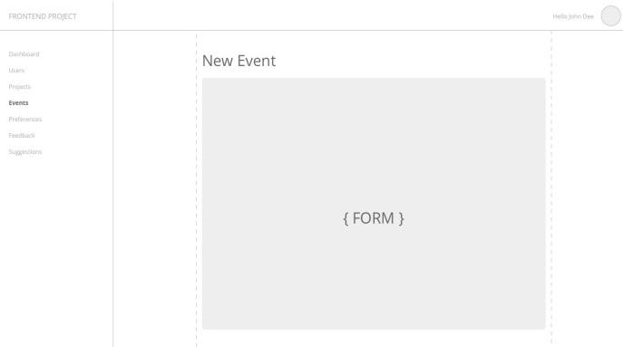
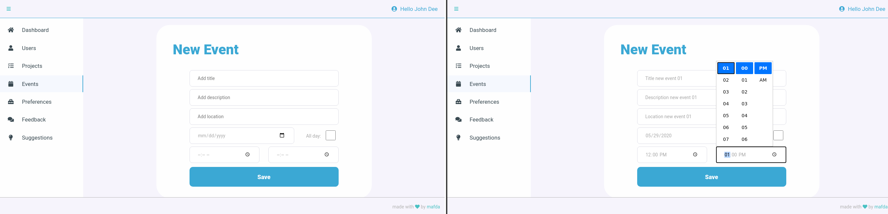
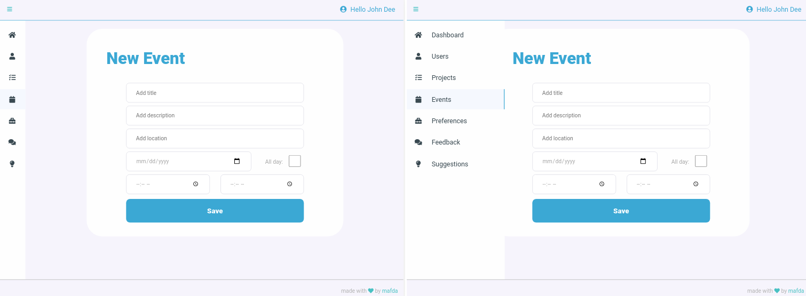
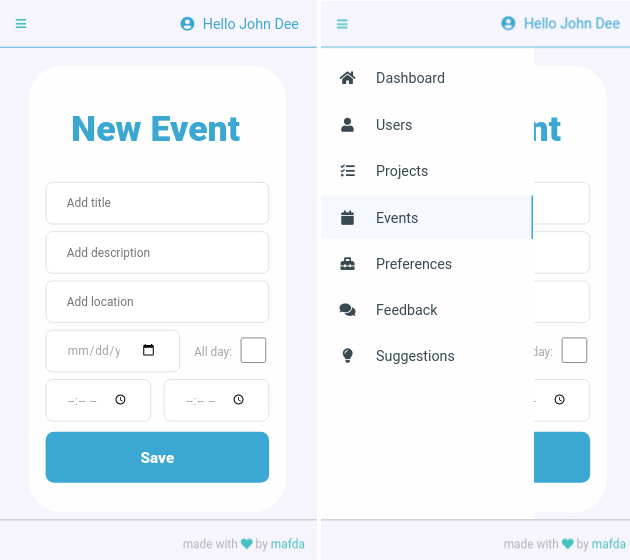

# Dashboard 

Front-end Challenge - Responsive single page dashboard with sliding side nav in pure HTML + CSS + JS (without using any development framework/library).

## 1. Briefing

The challenge is to develop a single page on a dashboard.

It must contain at least 3 parts: 

* a header with the user ID logged in, 
* a menu, and 
* a form to create an event.

The event form must have the following fields: 

* title, 
* description, 
* location and 
* if the event lasts all day, 
  * if not, request the start and end time.

## 2. Goals

No framework should be used for development (ex: Bootstrap CSS, jQuery, React, Angular, etc.).

What will be evaluated:

- Design (color palette, grid, spacing and typography);
- Responsiveness of the page (automatically adjust to any resolution);
- Operation in the main browsers (Chrome and Firefox);
- Good practices of HTML5 and CSS3 code.

## 3. Initial sketch

## 4. Final details

### Desktop (Chrome)
  

### Tablet
  

### Mobile

## 5. Interactive prototype

Heroku [link](http://mafda-dashboard-mosyle.herokuapp.com/).

---

made with 💙 by [mafda](https://mafda.github.io/) feat. [camiloariza](https://camiloarza.github.io/) 🤖 